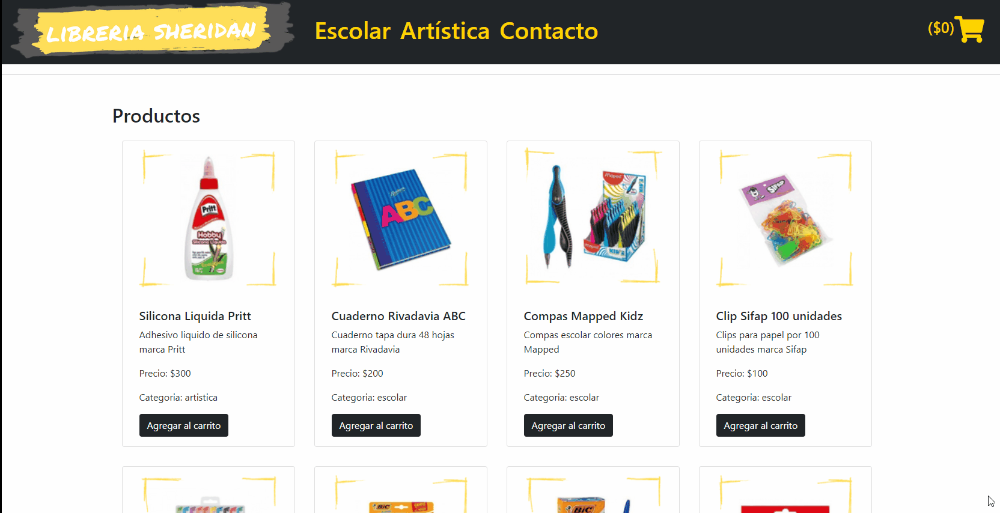

## Libería Sheridan

- El e-commerce de este proyecto es para un negocio de artículos de librería. Tiene el objetivo de llegar a un mayor número de potenciales clientes a través de una aplicación sencilla y amigable que aumente las posibilidades de realizar ventas.
- Este e-commerce cuenta con un catologo de productos que puede filtrarse por categorías a través del menú de navegación.
- Los productos son accesibles en forma individual donde se puede ver la descripción en detalle del artículo deseado.
- En el menú de navegación se incluye la categoría `Contacto` que a futuro incluirá un formulario de contacto para consultas y/o sugerencias.
- Proximamente contará con los botones necesarios para agregar al carrito, seleccionar cantidad de unidads y/o concretar la compra.

## Dependencias

### react

- El proyecto es realizado con `react-create-app`.

### react-bootstrap

- Se elige react-bootstrap como librería de estilos para mejorar y facilitar la interfaz gráfica. Además permite que la aplicación sea responsiva sin tener que agregar mas lineas de código a las hojas de estilo.

### node

- Se utiliza node version `14.18.0`.

## Run Project

En el root del proyecto ejecutar:
- `npm install`.
- `npm start`.
